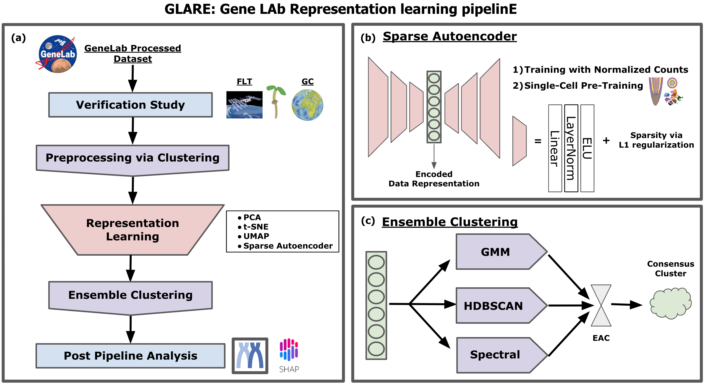

# Epigenetic map of root tip?

[Special thanks to Sofia's thesis ](https://repositorio.uam.es/bitstream/handle/10486/667993/otero\_perez\_sofia.pdf?sequence=1\&isAllowed=y)

**H3 dynamics model in the nucleus.**&#x20;

<figure><figcaption></figcaption></figure>

**H3 dynamics during embryo development.**&#x20;

<figure><figcaption></figcaption></figure>

**H3 dynamics regulate the transition from cell division to cell elongation.**&#x20;

<figure><figcaption></figcaption></figure>

**H3 dynamics model in the RAM.**&#x20;

<figure><figcaption>
Model of histone regulation within the Arabidospsi root.
</figcaption></figure>

The H3.1 decrease in the cells undergoing the last cell cycle, possibly controlled by a network of TF (E2F, ANT, KNAT etc), reprograms the chromatin before starting elongation and endoreplication. The reprogramming is also observed in the last endocycle. H3.1 decrease is associated with differentiation in the root and other organs.

<figure><figcaption>
H3.1 histone state is involved in S phase and DNa synthesis. 
</figcaption></figure>

<figure><figcaption>
H3.1 and H3.3 define the transition between the meristem and elongation zone.
</figcaption></figure>

**Histone changes that are involved in cell differentiation.**&#x20;

<figure><figcaption></figcaption></figure>

<figure><figcaption></figcaption></figure>

<figure><figcaption></figcaption></figure>

<figure><figcaption></figcaption></figure>

Future work

Compare to these datya...


