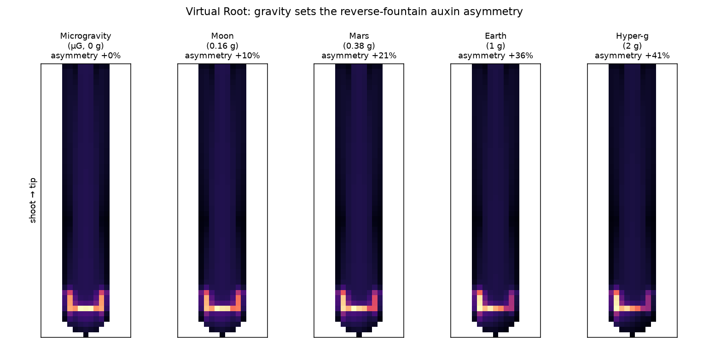
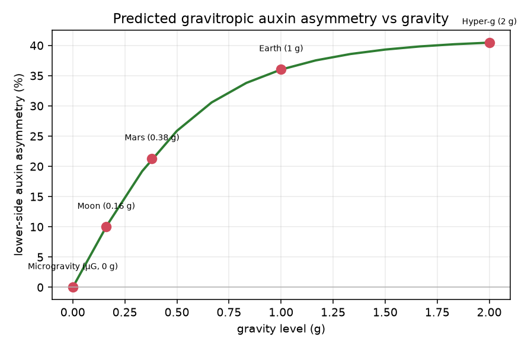
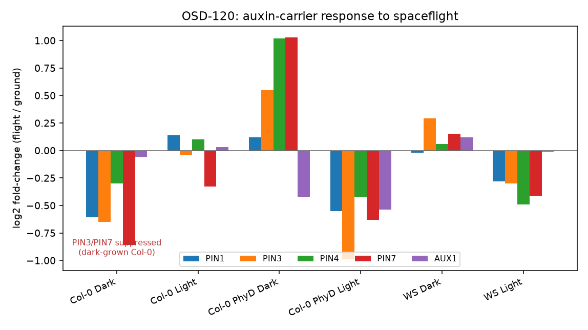
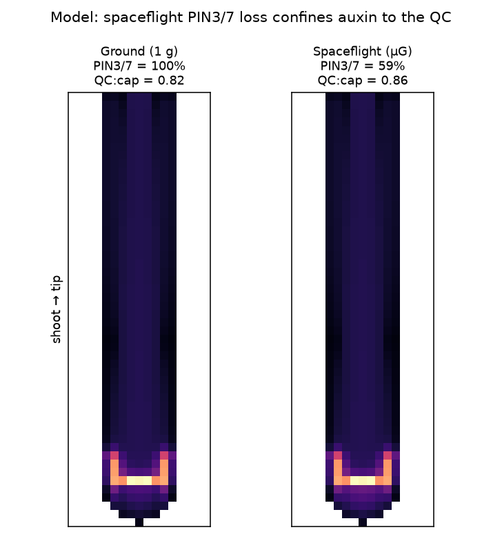
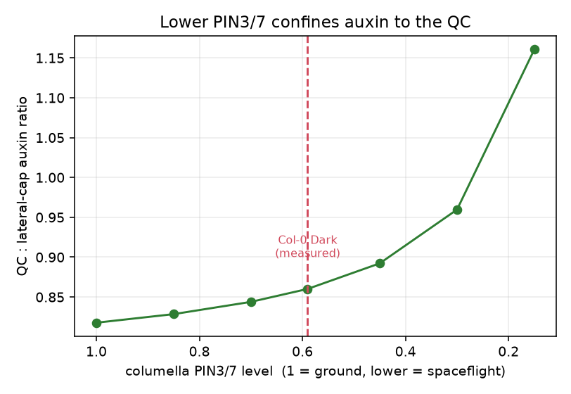

# Gravity sets the root's reverse-fountain: from Earth to microgravity, the Moon and Mars

*A model–transcriptome integration using the CARA (OSD-120) ISS dataset and the open Virtual Root simulator.*

**Authors:** R. Barker *et al.* ⬜ (confirm author list / CARA science team acknowledgement)
**Target:** *npj Microgravity* · **License:** CC0-1.0 · **Status:** peer-review draft

---

## Abstract
On Earth, roots orient by gravity: statoliths sediment, the auxin-efflux carrier **PIN3**
re-localises in the columella, and auxin is biased to the lower flank — the "reverse
fountain" that drives bending. What happens to this system when the gravity cue is weak or
absent? We combine a reanalysis of the **CARA** spaceflight root transcriptome (NASA OSDR
**OSD-120**) with an open, cell-based **auxin-transport model** (the *Virtual Root*). The
model shows that the lower-side auxin asymmetry scales with gravity — **0 % in microgravity,
~10 % on the Moon, ~21 % on Mars, ~36 % at 1 g, saturating near 41 % at 2 g**. Independently,
OSD-120 shows spaceflight **suppresses columella PIN3/PIN7 in a light- and genotype-dependent
manner** (strongest in dark-grown Col-0). Feeding the measured suppression into the model
**confines auxin toward the quiescent centre (QC)**. Two routes — loss of the biophysical cue
and loss of PIN3/7 expression — thus converge on the same outcome: a root tip that can no
longer build a directional auxin gradient. The framework yields testable predictions for
plant growth in partial and hyper-gravity relevant to lunar and Martian agriculture.

## 1. Introduction
Gravitropism is textbook plant biology, yet its mechanism is quantitative. Amyloplasts
(statoliths) sediment in columella cells; this repositions **PIN3/PIN7** efflux carriers so
that auxin, delivered rootward through the stele, is redistributed laterally and returns
shootward through the outer tissues — the **reverse-fountain / reflux** model
([Grieneisen et al. 2007](https://doi.org/10.1038/nature06215);
[Band et al. 2014](https://doi.org/10.1105/tpc.113.119495)). A directional gravity vector
biases this loop to the lower side, inhibiting elongation there and bending the root down.

Spaceflight removes the directional cue, and roots grown on the ISS show altered
architecture, skewing and waving. But the **mechanistic link** between the flight
transcriptome and the auxin field has been missing. Here we build that link: a reproducible
reanalysis of OSD-120 provides the carrier expression changes, and a transparent auxin
model turns them — and the gravity level itself — into predicted auxin distributions.

## 2. Results

### 2.1 Gravity sets the reverse-fountain auxin asymmetry
In the model, the columella PIN bias scales with the gravity level (a saturating,
statolith-like response). The predicted lower-side auxin asymmetry rises monotonically from
**microgravity (0 %)** through **Moon (0.16 g, ~10 %)** and **Mars (0.38 g, ~21 %)** to
**Earth (1 g, ~36 %)**, saturating by **2 g (~41 %)** (Fig 1). In microgravity the tip auxin
maximum is symmetric — the reverse fountain still forms, but with **no lateral direction**.

**Figure 1.** Predicted gravitropic auxin asymmetry across gravity levels. (a) Steady-state
auxin maps, µG→2 g. (b) Lower-side asymmetry vs gravity — a saturating dose–response;
microgravity gives zero directional asymmetry.

### 2.2 Spaceflight remodels the auxin carriers (OSD-120)
Reanalysing OSD-120 (flight vs ground, within each ecotype × light condition), the columella
carriers **PIN3 and PIN7 are suppressed most strongly in dark-grown Col-0** (log2FC −0.65 and
−0.86) and in *phyD* under light; in the dark, *phyD* and the WS ecotype instead **raise**
PIN3/7 (Fig 2). The response is therefore **light- and genotype-dependent** — consistent with
the study's aim of dissecting which spaceflight responses are dispensable.

**Figure 2.** OSD-120 flight-vs-ground log2 fold-changes for PIN1/3/4/7 and AUX1 across the
six ecotype × light conditions. PIN3/PIN7 suppression is clearest in dark-grown Col-0.

### 2.3 Measured PIN3/7 loss confines auxin to the QC
Setting the model's columella PIN3/7 level to the **measured** dark-grown Col-0 value
(≈ 59 % of ground) shifts auxin from the lateral root cap toward the QC (QC:cap ratio
0.82 → 0.86; Fig 3a,b). Across the plausible range the confinement increases as PIN3/7 falls
(Fig 3c), so the effect magnitude tracks the severity of suppression. The measured effect is
modest but **directionally consistent** with a tip that concentrates rather than
redistributes auxin.

**Figure 3.** (a,b) Auxin maps for ground (PIN3/7 = 100 %) vs spaceflight (dark Col-0,
PIN3/7 = 59 %). (c) QC:lateral-cap auxin ratio vs columella PIN3/7 level; dashed line = the
measured value.

### 2.4 The short-fat hypoxic phenotype emerges from an auxin→growth rule
Spaceflight roots are also short and fat — a **hypoxia** phenotype (no convection → water
films → low O₂ → ethylene). Coupling the auxin field to a turgor-growth rule, in which an
anisotropy parameter partitions volume growth axial vs radial, reproduces this: in air the
root grows **long and thin** (L/W ≈ 99), whereas under hypoxia (lower anisotropy + O₂) the
*same rule* yields a **short, fat** root (L/W ≈ 41), also shorter overall (Fig 5). The
short-fat shape is thus an **emergent** output of the model, not an imposed geometry.

**Figure 5.** Emergent root shape (left) and root length over time (right) for normoxic vs
spaceflight-hypoxic growth from the coupled auxin→growth model.

## 3. Discussion
Two independent routes converge on a root tip that cannot build a directional auxin gradient
in spaceflight: **(i)** loss of the *biophysical* cue (no statolith sedimentation → no PIN
bias → symmetric auxin, Fig 1), and **(ii)** loss of *PIN3/7 expression* (Fig 2 → confinement,
Fig 3). The transcriptomic route is light- and *PhyD*-dependent, linking **photomorphogenesis
to the gravity response** — a plausible reason light partially rescues spaceflight root
phenotypes.

The gravity series (Fig 1) makes concrete, testable predictions for **partial gravity**: a
graded, saturating gravitropic competence that is already ~60 % of Earth's on Mars but only
~30 % on the Moon — relevant to designing lunar vs Martian plant-growth systems — and a
near-plateau under hypergravity. These are directly testable on **random-positioning
machines / clinostats and centrifuges** (e.g. the CoSE SciSpinner Max) with DII-VENUS/R2D2
auxin imaging.

**Limitations.** OSD-120 is bulk root-tip RNA-seq (tissue assignment of PIN3/7 to the
columella uses prior atlases); the model is an idealised 2-D root; and the flight PIN3/7
effect, though real, is modest at the measured fold-change. Single-cell data and quantitative
imaging would sharpen the parameterisation.

## 4. Methods
- **Reanalysis:** OSD-120 processed data (GeneLab consensus pipeline) → flight-vs-ground
  contrasts; auxin-carrier fold-changes extracted by AGI. See
  [`reanalysis/PIPELINE.md`](../reanalysis/PIPELINE.md) and `reanalysis/scripts/`.
- **Model:** two-compartment (cell + apoplast) auxin transport with carrier-modulated
  permeabilities; PIN/AUX1 maps after Band 2014; gravity scales the columella bias; PIN3/7
  sets the columella level. Spec: [Virtual Root `SPEC.md`](https://github.com/dr-richard-barker/virtual-root/blob/main/SPEC.md).
- **Figures:** `reanalysis/scripts/04_make_figures.py` and the Virtual Root `gravity_series.py`.

## 5. Data & code availability
- Data: **OSD-120 / GLDS-120** (NASA OSDR).
- Reanalysis + figures: this repository (**Zenodo DOI** on release).
- Model: [Virtual Root](https://github.com/dr-richard-barker/virtual-root) (interactive:
  <https://dr-richard-barker.github.io/virtual-root/>) — the µG and gravity presets reproduce
  Figs 1 & 3 live.

## References
Grieneisen *et al.* (2007) *Nature* 449:1008 · Band *et al.* (2014) *Plant Cell* 26:862 ·
Paul, Ferl *et al.* OSD-120 · Brunoud *et al.* (2012) *Nature* 482:103 · Liao *et al.* (2015)
*Nat. Methods* 12:207. ⬜ complete reference list at submission.
