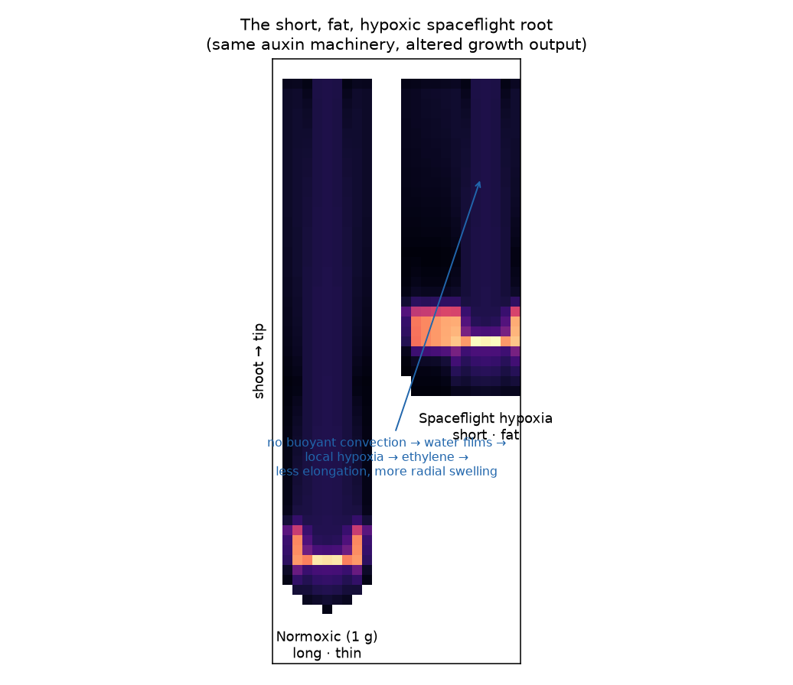
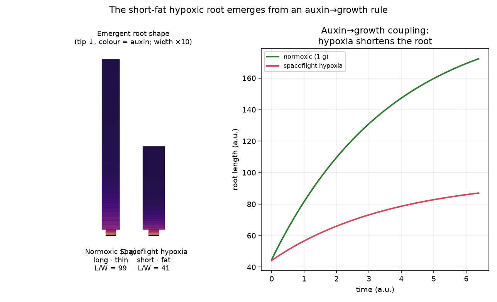

# The short, fat, hypoxic spaceflight root

**Figure 4.** The same auxin-transport model on a normal (long, thin) vs a hypoxic
(short, fat) root geometry. The auxin machinery — and the QC auxin maximum — is unchanged;
only the growth output differs.

## Why spaceflight roots go short and fat
On Earth, **buoyancy-driven convection** constantly mixes gases around the root, and gravity
drains water so a thin, aerated film remains. In **microgravity there is no convection**:
water is held around the root by surface tension, gas exchange collapses, and O₂ cannot
diffuse in fast enough — the root tip experiences **local hypoxia**.

Hypoxia triggers a stereotyped morphology:
- **Ethylene** accumulates (hypoxia induces its biosynthesis; poor gas exchange traps it).
- Ethylene + altered **auxin** shift growth from **axial elongation** to **radial expansion**
  (loss of growth anisotropy — cortical cells swell sideways instead of lengthening).
- The result is the classic **short, fat root**, often with reduced/agravitropic waving —
  and it overlaps the **dwarfing / skewing** phenotype seen in CARA
  (see [`hypoxia-induced-dwarfing-skew.md`](hypoxia-induced-dwarfing-skew.md)).

## How it connects to the auxin model
The auxin-transport model predicts the **auxin field** (QC maximum + reflux); it does not
itself grow the root. The short-fat phenotype is the **growth read-out** of that field under
hypoxia:
- The QC auxin maximum still forms (Fig 4, both geometries) — the tip patterning is robust.
- What changes is the **elongation-zone response**: hypoxia/ethylene blunt auxin-driven
  axial elongation and redirect it radially. Modelled here as a **geometry change** (a wider,
  shorter root) rather than a transport change — the machinery is the same, the growth differs.
- This is complementary to the PIN3/7 route (µG → auxin confined to the QC): PIN3/7 loss
  changes *where* auxin sits; hypoxia changes *how the root grows* in response to it.

## The short-fat root emerges from an auxin→growth rule

**Figure 5.** Coupling the auxin field to growth (`reanalysis/scripts/06_growth_model.py`).
Each cell grows by turgor at an **O₂-limited, auxin-gated** rate; a single anisotropy
parameter **α** partitions that volume growth **axial vs radial**. In air (α high, full O₂)
the root grows **long and thin** (L/W ≈ 99); under spaceflight **hypoxia** (α low, reduced
O₂ → ethylene) the *same rule* yields a **short, fat** root (L/W ≈ 41) that is also shorter
overall (growth-curve, right). **The short-fat phenotype is now an emergent output of the
model, not an imposed shape.**

> **Caveat — these L/W numbers are illustrative, not calibrated.** They are set by the
> anisotropy parameter `α` and a display width-scale, not fitted to data. The short-fat
> prediction is **not corroborated** by the CARA-lineage morphometrics: RootNav re-measurement
> (light/dark separated) shows flight roots modestly **shorter in all six** genotype × light
> conditions but **thinner, not fatter, in 4 of 6** (wider only in *phyD*-light), and OSD-121's
> apparent size drop was largely a **calibration artifact** (mm² *p* = 0.30). The model's
> **validated** result is the directional one: µG → symmetric auxin → **loss of directional
> organisation** (OSD-121 angle dispersion 51.2° vs 45.3°, *p* < 10⁻⁴). Full write-up:
> [`model_vs_morphometrics_validation.md`](model_vs_morphometrics_validation.md).

## Next modelling steps
- **Feed the real profile:** drive growth with the 2-D transport model's axis auxin gradient
  (rather than the analytic profile used here).
- **Explicit ethylene node:** a hypoxia-induced ethylene variable that lowers α (currently α
  and O₂ are set by hand per condition).
- **Validate:** compare predicted length/diameter/surface/volume ratios to the CARA physiology
  ANOVAs in `results/` and to root morphometrics (RSML / RootNav).
