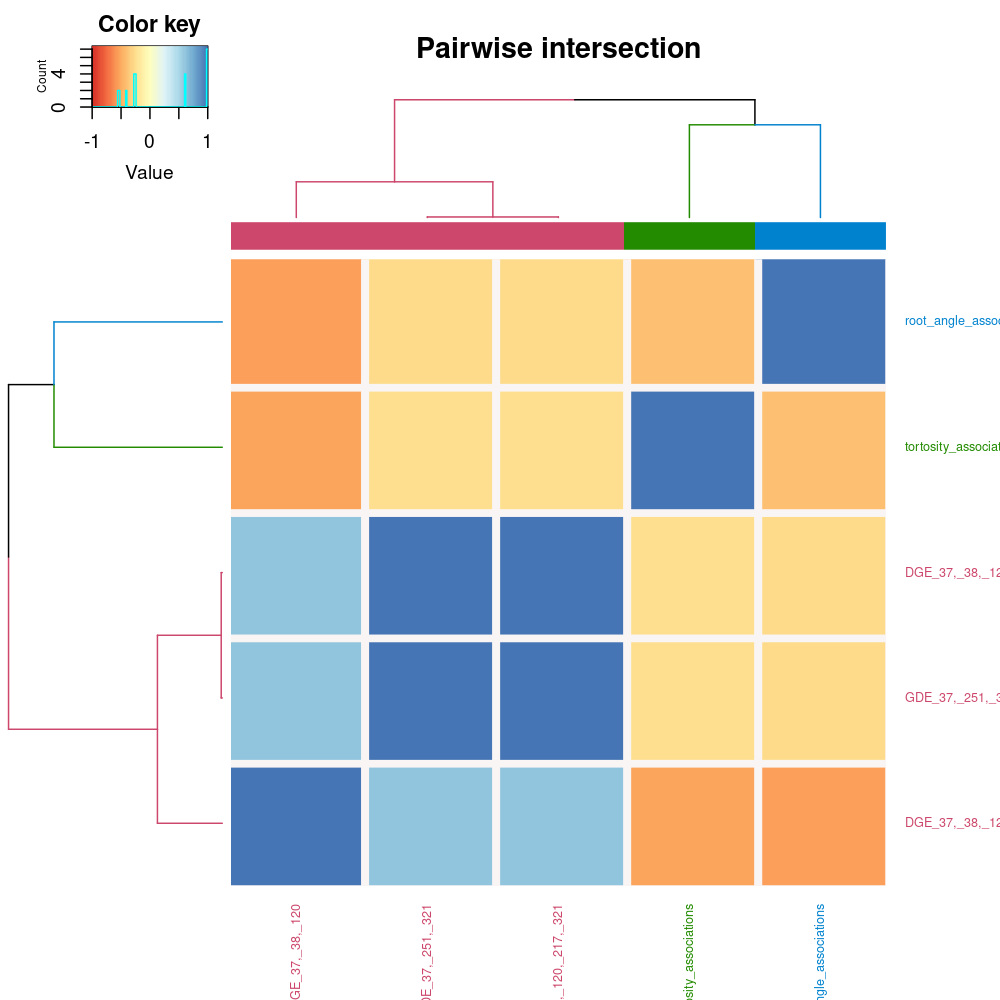
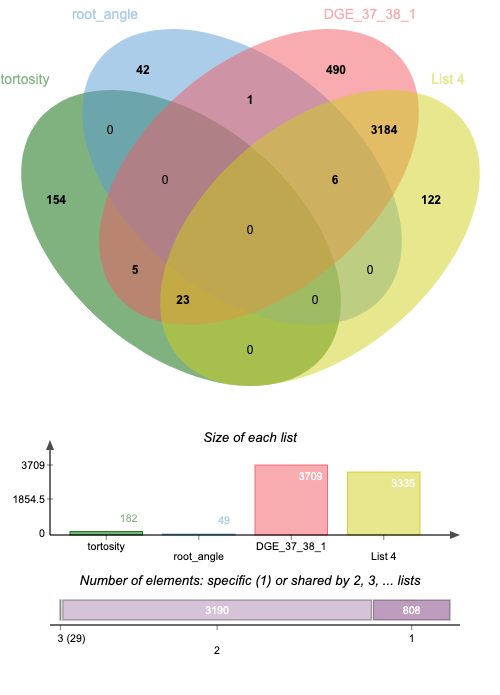

# Spaceflight GWAS and Skewing intersect analysis

<table><thead><tr><th width="196">Groups</th><th width="141">Combined</th><th width="90">Symbol</th><th width="223">Summary</th><th width="100">SUBA5 location</th></tr></thead><tbody><tr><td>root_angle|5 OSDR|3 OSDR</td><td>AT3G10340</td><td>PAL4</td><td>phenylalanine ammonia-lyase 4</td><td></td></tr><tr><td>root_angle|5 OSDR|3 OSDR</td><td>AT2G13540</td><td>ABH1</td><td>ARM repeat superfamily protein</td><td>cytosol</td></tr><tr><td>root_angle|5 OSDR|3 OSDR</td><td>AT5G22880</td><td>HTB2</td><td>histone B2</td><td>nucleus</td></tr><tr><td>root_angle|5 OSDR|3 OSDR</td><td>AT5G35590</td><td>PAA1</td><td>proteasome alpha subunit A1</td><td></td></tr><tr><td>root_angle|5 OSDR|3 OSDR</td><td>AT5G49360</td><td>BXL1</td><td>beta-xylosidase 1</td><td>extracellular</td></tr><tr><td>root_angle|5 OSDR|3 OSDR</td><td>AT1G55580</td><td>LAS</td><td>GRAS family transcription factor</td><td>nucleus</td></tr><tr><td>root_angle|5 OSDR</td><td>AT3G23100</td><td>XRCC4</td><td>homolog of human DNA ligase iv-binding protein XRCC4</td><td>nucleus</td></tr><tr><td>tortosity|5 OSDR</td><td>AT3G05870</td><td>APC11</td><td>anaphase-promoting complex/cyclosome 11</td><td>cytosol</td></tr><tr><td>tortosity|5 OSDR</td><td>AT5G11710</td><td>AT5G11710</td><td>ENTH/VHS family protein</td><td></td></tr><tr><td>tortosity|5 OSDR</td><td>AT5G25220</td><td>KNAT3</td><td>KNOTTED1-like homeobox gene 3</td><td>nucleus</td></tr><tr><td>tortosity|5 OSDR</td><td>AT4G37580</td><td>HLS1</td><td>Acyl-CoA N-acyltransferases (NAT) superfamily protein</td><td>cytosol</td></tr><tr><td>tortosity|5 OSDR</td><td>AT3G56000</td><td>CSLA14</td><td>cellulose synthase like A14</td><td></td></tr><tr><td>tortosity|5 OSDR|3 OSDR</td><td>AT2G01340</td><td>At17.1</td><td>NULL</td><td></td></tr><tr><td>tortosity|5 OSDR|3 OSDR</td><td>AT2G01350</td><td>QPT</td><td>quinolinate phoshoribosyltransferase</td><td>plastid</td></tr><tr><td>tortosity|5 OSDR|3 OSDR</td><td>AT5G01400</td><td>ESP4</td><td>HEAT repeat-containing protein</td><td>nucleus</td></tr><tr><td>tortosity|5 OSDR|3 OSDR</td><td>AT5G01410</td><td>RSR4</td><td>Aldolase-type TIM barrel family protein</td><td>cytosol</td></tr><tr><td>tortosity|5 OSDR|3 OSDR</td><td>AT5G02560</td><td>HTA12</td><td>histone H2A 12</td><td></td></tr><tr><td>tortosity|5 OSDR|3 OSDR</td><td>AT3G66658</td><td>ALDH22A1</td><td>aldehyde dehydrogenase 22A1</td><td></td></tr><tr><td>tortosity|5 OSDR|3 OSDR</td><td>AT5G11670</td><td>NADP-ME2</td><td>NADP-malic enzyme 2</td><td>cytosol</td></tr><tr><td>tortosity|5 OSDR|3 OSDR</td><td>AT5G11690</td><td>TIM17-3</td><td>translocase inner membrane subunit 17-3</td><td>mitochondrion</td></tr><tr><td>tortosity|5 OSDR|3 OSDR</td><td>AT2G17370</td><td>HMG2</td><td>3-hydroxy-3-methylglutaryl-CoA reductase 2</td><td></td></tr><tr><td>tortosity|5 OSDR|3 OSDR</td><td>AT2G17380</td><td>AP19</td><td>associated protein 19</td><td></td></tr><tr><td>tortosity|5 OSDR|3 OSDR</td><td>AT3G22460</td><td>OASA2</td><td>O-acetylserine (thiol) lyase (OAS-TL) isoform A2</td><td></td></tr><tr><td>tortosity|5 OSDR|3 OSDR</td><td>AT1G22920</td><td>CSN5A</td><td>COP9 signalosome 5A</td><td></td></tr><tr><td>tortosity|5 OSDR|3 OSDR</td><td>AT1G24706</td><td>THO2</td><td>THO2</td><td>nucleus</td></tr><tr><td>tortosity|5 OSDR|3 OSDR</td><td>AT2G22010</td><td>RKP</td><td>related to KPC1</td><td></td></tr><tr><td>tortosity|5 OSDR|3 OSDR</td><td>AT4G34460</td><td>AGB1</td><td>GTP binding protein beta 1</td><td></td></tr><tr><td>tortosity|5 OSDR|3 OSDR</td><td>AT4G34490</td><td>CAP1</td><td>cyclase associated protein 1</td><td>cytosol</td></tr><tr><td>tortosity|5 OSDR|3 OSDR</td><td>AT2G43820</td><td>UGT74F2</td><td>UDP-glucosyltransferase 74F2</td><td></td></tr><tr><td>tortosity|5 OSDR|3 OSDR</td><td>AT2G43840</td><td>UGT74F1</td><td>UDP-glycosyltransferase 74 F1</td><td></td></tr><tr><td>tortosity|5 OSDR|3 OSDR</td><td>AT1G50600</td><td>SCL5</td><td>scarecrow-like 5</td><td></td></tr><tr><td>tortosity|5 OSDR|3 OSDR</td><td>AT3G55990</td><td>ESK1</td><td>Plant protein of unknown function (DUF828)</td><td>golgi</td></tr><tr><td>tortosity|5 OSDR|3 OSDR</td><td>AT3G56690</td><td>CIP111</td><td>Cam interacting protein 111</td><td>plastid</td></tr><tr><td>tortosity|5 OSDR|3 OSDR</td><td>AT5G59520</td><td>ZIP2</td><td>ZRT/IRT-like protein 2</td><td>plasma membrane</td></tr><tr><td>tortosity|5 OSDR|3 OSDR</td><td>AT5G60360</td><td>ALP</td><td>aleurain-like protease</td><td>vacuole</td></tr></tbody></table>

GWAS intersect with differentially expressed loci from OSDR meta-analysis.&#x20;

<table><thead><tr><th width="188"></th><th width="127">Combined</th><th width="90">Symbol</th><th width="207">Summary</th><th width="128">SUBA5 location</th></tr></thead><tbody><tr><td>root_angle|5 OSDR|3 OSDR</td><td><strong>AT3G10340</strong></td><td>PAL4</td><td>phenylalanine ammonia-lyase 4</td><td></td></tr><tr><td>root_angle|5 OSDR|3 OSDR</td><td>AT2G13540</td><td>ABH1</td><td>ARM repeat superfamily protein</td><td>cytosol</td></tr><tr><td>root_angle|5 OSDR|3 OSDR</td><td><strong>AT5G22880</strong></td><td>HTB2</td><td>histone B2</td><td>nucleus</td></tr><tr><td>root_angle|5 OSDR|3 OSDR</td><td>AT5G35590</td><td>PAA1</td><td>proteasome alpha subunit A1</td><td></td></tr><tr><td>root_angle|5 OSDR|3 OSDR</td><td><strong>AT5G49360</strong></td><td>BXL1</td><td>beta-xylosidase 1</td><td>extracellular</td></tr><tr><td>root_angle|5 OSDR|3 OSDR</td><td><strong>AT1G55580</strong></td><td>LAS</td><td>GRAS family transcription factor</td><td>nucleus</td></tr><tr><td>root_angle|5 OSDR</td><td>AT3G23100</td><td>XRCC4</td><td>homolog of human DNA ligase iv-binding protein XRCC4</td><td>nucleus</td></tr><tr><td>tortosity|5 OSDR</td><td>AT3G05870</td><td>APC11</td><td>anaphase-promoting complex/cyclosome 11</td><td>cytosol</td></tr><tr><td>tortosity|5 OSDR</td><td>AT5G11710</td><td>AT5G11710</td><td>ENTH/VHS family protein</td><td></td></tr><tr><td>tortosity|5 OSDR</td><td><strong>AT5G25220</strong></td><td>KNAT3</td><td>KNOTTED1-like homeobox gene 3</td><td>nucleus</td></tr><tr><td>tortosity|5 OSDR</td><td><strong>AT4G37580</strong></td><td>HLS1</td><td>Acyl-CoA N-acyltransferases (NAT) superfamily protein</td><td>cytosol</td></tr><tr><td>tortosity|5 OSDR</td><td><strong>AT3G56000</strong></td><td>CSLA14</td><td>cellulose synthase like A14</td><td></td></tr><tr><td>tortosity|5 OSDR|3 OSDR</td><td>AT2G01340</td><td>At17.1</td><td>NULL - defence signaling </td><td></td></tr><tr><td>tortosity|5 OSDR|3 OSDR</td><td><strong>AT2G01350</strong></td><td>QPT</td><td>quinolinate phoshoribosyltransferase</td><td>plastid</td></tr><tr><td>tortosity|5 OSDR|3 OSDR</td><td>AT5G01400</td><td>ESP4</td><td>HEAT repeat-containing protein</td><td>nucleus</td></tr><tr><td>tortosity|5 OSDR|3 OSDR</td><td><strong>AT5G01410</strong></td><td>RSR4</td><td>Aldolase-type TIM barrel family protein</td><td>cytosol</td></tr><tr><td>tortosity|5 OSDR|3 OSDR</td><td>AT5G02560</td><td>HTA12</td><td>histone H2A 12</td><td></td></tr><tr><td>tortosity|5 OSDR|3 OSDR</td><td>AT3G66658</td><td>ALDH22A1</td><td>aldehyde dehydrogenase 22A1</td><td></td></tr><tr><td>tortosity|5 OSDR|3 OSDR</td><td><strong>AT5G11670</strong></td><td>NADP-ME2</td><td>NADP-malic enzyme 2</td><td>cytosol</td></tr><tr><td>tortosity|5 OSDR|3 OSDR</td><td><strong>AT5G11690</strong></td><td>TIM17-3</td><td>translocase inner membrane subunit 17-3</td><td>mitochondrion</td></tr><tr><td>tortosity|5 OSDR|3 OSDR</td><td><strong>AT2G17370</strong></td><td>HMG2</td><td>3-hydroxy-3-methylglutaryl-CoA reductase 2</td><td></td></tr><tr><td>tortosity|5 OSDR|3 OSDR</td><td>AT2G17380</td><td>AP19</td><td>associated protein 19</td><td></td></tr><tr><td>tortosity|5 OSDR|3 OSDR</td><td>AT3G22460</td><td>OASA2</td><td>O-acetylserine (thiol) lyase (OAS-TL) isoform A2</td><td></td></tr><tr><td>tortosity|5 OSDR|3 OSDR</td><td><strong>AT1G22920</strong></td><td>CSN5A</td><td>COP9 signalosome 5A</td><td></td></tr><tr><td>tortosity|5 OSDR|3 OSDR</td><td>AT1G24706</td><td>THO2</td><td>THO2</td><td>nucleus</td></tr><tr><td>tortosity|5 OSDR|3 OSDR</td><td>AT2G22010</td><td>RKP</td><td>related to KPC1</td><td></td></tr><tr><td>tortosity|5 OSDR|3 OSDR</td><td>AT4G34460</td><td>AGB1</td><td>GTP binding protein beta 1</td><td></td></tr><tr><td>tortosity|5 OSDR|3 OSDR</td><td>AT4G34490</td><td>CAP1</td><td>cyclase associated protein 1</td><td>cytosol</td></tr><tr><td>tortosity|5 OSDR|3 OSDR</td><td>AT2G43820</td><td>UGT74F2</td><td>UDP-glucosyltransferase 74F2</td><td></td></tr><tr><td>tortosity|5 OSDR|3 OSDR</td><td>AT2G43840</td><td>UGT74F1</td><td>UDP-glycosyltransferase 74 F1</td><td></td></tr><tr><td>tortosity|5 OSDR|3 OSDR</td><td><strong>AT1G50600</strong></td><td>SCL5</td><td>scarecrow-like 5</td><td></td></tr><tr><td>tortosity|5 OSDR|3 OSDR</td><td>AT3G55990</td><td>ESK1</td><td>Plant protein of unknown function (DUF828)</td><td>golgi</td></tr><tr><td>tortosity|5 OSDR|3 OSDR</td><td><strong>AT3G56690</strong></td><td>CIP111</td><td>Cam interacting protein 111</td><td>plastid</td></tr><tr><td>tortosity|5 OSDR|3 OSDR</td><td><strong>AT5G59520</strong></td><td>ZIP2</td><td>ZRT/IRT-like protein 2</td><td>plasma membrane</td></tr><tr><td>tortosity|5 OSDR|3 OSDR</td><td>AT5G60360</td><td>ALP</td><td>aleurain-like protease</td><td>vacuole</td></tr></tbody></table>

GWAS\_tortosity\_associations&#x20;

GWAS\_root\_angle\_associations&#x20;

DGE\_37,\_38,\_120&#x20;

GDE\_37,\_251,\_321&#x20;

DGE\_37,\_38,\_120,\_217,\_321

<figure><figcaption></figcaption></figure>

<figure><figcaption></figcaption></figure>

<figure><figcaption></figcaption></figure>

<figure><figcaption></figcaption></figure>

Gene Ontology (GO) Categories and Descriptions with Statistical Analysis

<figure><figcaption></figcaption></figure>

## Gene Ontology (GO) Categories and Descriptions with Statistical Analysis

This section presents the results of a statistical analysis of gene ontology (GO) categories, covering Biological Processes, Molecular Functions, and Cellular Components. For each category, a description is provided alongside the count and statistical significance of observed phenomena.

### Biological Processes

1. **Organic Hydroxy Compound Metabolic Process**
   * **GO ID:** GO:1901615
   * **Count:** 4 (12.12%)
   * **Log10(P):** -3.10
   * **Log10(q):** 0.00
2. **Pyridine-containing Compound Metabolic Process**
   * **GO ID:** GO:0072524
   * **Count:** 3 (9.09%)
   * **Log10(P):** -3.03
   * **Log10(q):** 0.00

### Molecular Functions

1. **Glycosyltransferase Activity**
   * **GO ID:** GO:0016757
   * **Count:** 5 (15.15%)
   * **Log10(P):** -2.51
   * **Log10(q):** 0.00

### Cellular Components

1. **Nuclear Protein-containing Complex**
   * **GO ID:** GO:0140513
   * **Count:** 4 (12.12%)
   * **Log10(P):** -2.16
   * **Log10(q):** 0.00
2. **Membrane Protein Complex**
   * **GO ID:** GO:0098796
   * **Count:** 3 (9.09%)
   * **Log10(P):** -1.50
   * **Log10(q):** 0.00

<figure><figcaption></figcaption></figure>

#### Protein-protein Interaction Enrichment Analysis

For each gene list, we conducted a protein-protein interaction enrichment analysis using databases such as STRING, BioGrid, OmniPath, and InWeb\_IM. The network derived from this analysis includes a subset of proteins that have at least one physical interaction with another protein in the list. If the network consists of 3 to 500 proteins, we apply the Molecular Complex Detection (MCODE) algorithm to identify densely connected network regions. The identified MCODE networks for each gene list are presented in Figure 5. Furthermore, we conducted pathway and process enrichment analyses on each MCODE component separately. We retained the three highest-ranked terms by p-value as the functional descriptors for each component. These are depicted in the tables beneath the network illustrations in Figure 5.

<figure><figcaption></figcaption></figure>

**All lists merged Colored by Counts(Full Connection)**

| GO         | Description                                   | Log10(P) |
| ---------- | --------------------------------------------- | -------- |
| GO:0042537 | benzene-containing compound metabolic process | -4.7     |
| GO:0009723 | response to ethylene                          | -3.0     |
| GO:0046527 | glucosyltransferase activity                  | -2.9     |

'


Link to interactive version


<table><thead><tr><th width="227">Category</th><th width="258">Description</th><th width="76">LogP</th><th width="476">Hits</th></tr></thead><tbody><tr><td>GO Biological Processes</td><td>organic hydroxy compound metabolic process</td><td>-3.8</td><td>HMG2|UGT74F2|UGT74F1|RSR4</td></tr><tr><td>GO Biological Processes</td><td>pyridine-containing compound metabolic process</td><td>-3.6</td><td>QPT|NADP-ME2|RSR4</td></tr><tr><td>GO Biological Processes</td><td><strong>amino acid metabolic process</strong></td><td>-3.2</td><td>UGT74F2|UGT74F1|OASA2|RSR4</td></tr><tr><td>GO Biological Processes</td><td>purine nucleotide metabolic process</td><td>-2.7</td><td>QPT|HMG2|NADP-ME2</td></tr><tr><td>GO Biological Processes</td><td>organophosphate metabolic process</td><td>-2.6</td><td>QPT|HMG2|NADP-ME2|RSR4</td></tr><tr><td>GO Biological Processes</td><td>purine-containing compound metabolic process</td><td>-2.6</td><td>QPT|HMG2|NADP-ME2</td></tr><tr><td>GO Biological Processes</td><td>nucleotide metabolic process</td><td>-2.5</td><td>QPT|HMG2|NADP-ME2</td></tr><tr><td>GO Biological Processes</td><td>nucleoside phosphate metabolic process</td><td>-2.5</td><td>QPT|HMG2|NADP-ME2</td></tr><tr><td>GO Molecular Functions</td><td>glycosyltransferase activity</td><td>-2.4</td><td>QPT|UGT74F2|UGT74F1|ZIP2</td></tr><tr><td>GO Biological Processes</td><td>nucleobase-containing small molecule metabolic process</td><td>-2.1</td><td>QPT|HMG2|NADP-ME2</td></tr><tr><td>WikiPathways</td><td>Seed development</td><td>-2.1</td><td>UGT74F2|UGT74F1|CSN5A</td></tr><tr><td>GO Cellular Components</td><td><strong>membrane protein complex</strong></td><td>-2</td><td>AP19|AGB1|TIM17-3</td></tr><tr><td>GO Biological Processes</td><td><strong>carboxylic acid metabolic process</strong></td><td>-2</td><td>UGT74F2|UGT74F1|OASA2|NADP-ME2</td></tr><tr><td>GO Cellular Components</td><td>nuclear protein-containing complex</td><td>-1.9</td><td>

ESP4|CSN5A|THO2
</td></tr></tbody></table>

<figure><figcaption>
<a href="https://knetminer.com/beta/knetspace/network/82664856-9a2d-4925-9b09-8952578351e1">https://knetminer.com/beta/knetspace/network/82664856-9a2d-4925-9b09-8952578351e1</a>
</figcaption></figure>

<table><thead><tr><th width="286">Intersecting lists</th><th width="171">Loci used in Knet-1</th></tr></thead><tbody><tr><td>root_angle|5 OSDR|3 OSDR</td><td>AT3G10340</td></tr><tr><td>root_angle|5 OSDR|3 OSDR</td><td>AT2G13540</td></tr><tr><td>root_angle|5 OSDR|3 OSDR</td><td>AT5G22880</td></tr><tr><td>root_angle|5 OSDR|3 OSDR</td><td>AT5G35590</td></tr><tr><td>root_angle|5 OSDR|3 OSDR</td><td>AT5G49360</td></tr><tr><td>root_angle|5 OSDR|3 OSDR</td><td>AT1G55580</td></tr><tr><td>root_angle|5 OSDR</td><td>AT3G23100</td></tr><tr><td>tortosity|5 OSDR</td><td>AT3G05870</td></tr><tr><td>tortosity|5 OSDR</td><td>AT5G11710</td></tr><tr><td>tortosity|5 OSDR</td><td>AT5G25220</td></tr><tr><td>tortosity|5 OSDR</td><td>AT4G37580</td></tr><tr><td>tortosity|5 OSDR</td><td>AT3G56000</td></tr></tbody></table>

**Some of these loci might be involved in the hypoxia-induced skew in space flight.**&#x20;

**Probably going to pin it on the ethylene signalling and COP2 circadian adjustment... tbc**&#x20;

